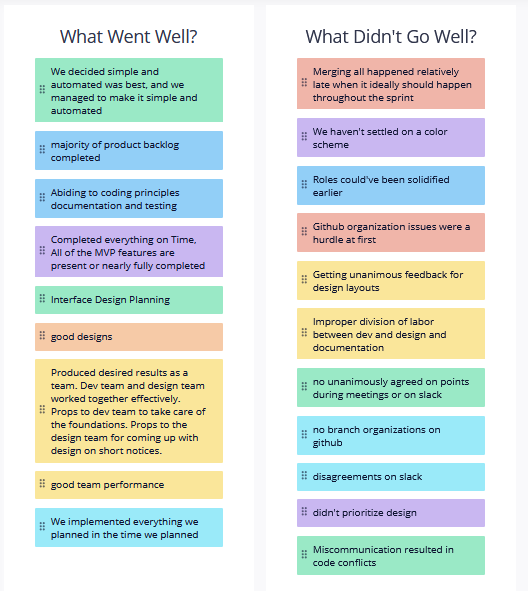

# Sprint 2 Retrospective

For our retrospective, we used Retrium. Members of our team put forward what they thought went well in our Sprint 2 and what they thought could have been done better. 
We compiled all these thought to define the approach we will take for our next sprint i.e. the Beta Sprint. These thoughts have been listed below.

## What went well & What could have been done better

