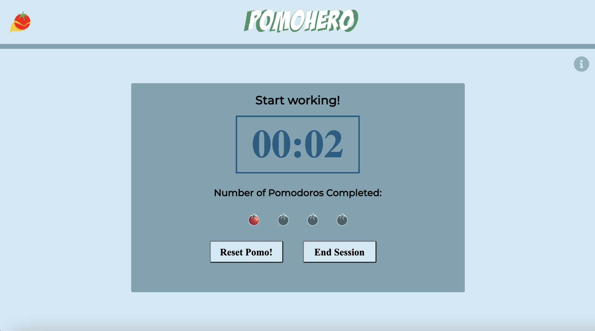
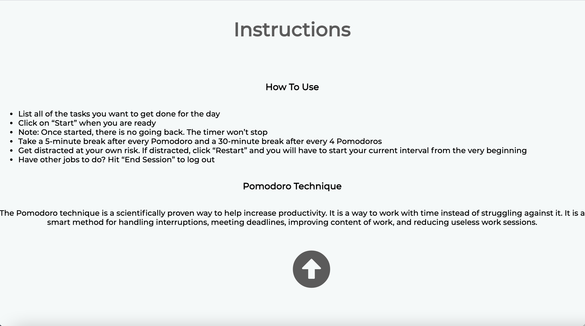

# Sprint 2 Review

## Teamato - Group 30

### Software Results
The end of sprint 2 has seen the completion of a majority of the central backlog as well as the entire sprint backlog that had been planned to be completed at the start of the sprint. 

The features that were completed include a fully functional automated timer with a start, reset, and an end buttons. Brief yet detailed instructions are provided for the user which the user can see if they scroll down. The design of the software is simple and modern, with the employment of cool colors that aid in the concentration and focus of the user. We have fully documented our code, with comments for all major classes and functions. There has been thorough testing of JavaScript source code along with the emphasis on the use of web components to allow encapsulation of elements.

Apart from the user interface, the team has seen the foundation and development of a rigid Git flow, with a surpassing build pipeline. Upon the creation of a Pull Request, the pipeline immediately starts a series of processes which involve the annotation of documentation by JSDoc for JavaScript source code files and the enforcement of style guidelines as well as syntax errors by the GitHub Super-Linter.

This sprint has laid the road for the incorporation of yet more features for our users. The fact that we have been able to complete the sprint within the proposed deadline of February 21, 2021 along with the shipping of a well-documented and tested code base will save us lots of time for avoiding to have to do major code refactoring.

### Software demonstration
[](../videos/Sprint2Software.mp4)





### Team Accomplishments
As a team, we are really happy with how the sprint has gone by. Everything went well, and we were able to do all that we had planned. The design group has excelled with the design, styling, and layout of the software; the development group has showed their power of executing flawless code.

The software which we have shipped as a group is something that we all are proud of, given the amount of hard work we have put into it during the course of the sprint. We have worked together well, handling disagreements and issues efficiently.

We are also aware that our team leaders have given in their one hundred percent with their continuous supervision, help, and valuable insights. We have come closer as a team, trusting and working with each other, and growing together in the process.

### Individual Contributions

#### Muhammad Zubair Khan
As one of the managers, my duties were to oversee the whole team while focusing more on the developement part. In the early weeks, me and Xavier, the other manager, took care of the logistical stuff such as coordinating with the team to decide meeting times, leading those meetings etc. After we were done with all the logistics and planning, I partnered with the dev team and took part in mob coding the javascript aspect of our timerContainer Custom Components. Specifically, I implemented the ```getTimeRemaining()``` function and the ```progressState()``` function. I also wrote the tests for our Custom Web Components i.e. the timerDisplay and the timerContainer. Lastly, I was also responsible of creating and updating our team's ADRs.  

### Current backlog
The current central backlog includes the implementation of task list functionality, which will enable the user to add and delete tasks within the app instead of having to use an external software to manage work. This will greatly minimize unintentional investments of time.

We also plan on implementing a theme changing button which will help the user to focus on their work under a color theme of their preference.

Finally, we wish to have an analytics tab providing the user with useful analytics on how their day went and how much work they got done, which will be very effective for future retrospecting.

### Next steps
The coming sprint - the beta sprint - will prioritize the implementation of task list functionality. Once a working task list is set up, we will also execute a theme changing feature, given there is still time left. Analytics will be pushed back to the final sprint. The pipeline, during the sprint, will be further developed and nuanced, with emphasis on branch organization and handling of merge conflicts.

The next sprint will again be a short two-week sprint. We expect to ship our revised software by March 7, 2021. 
