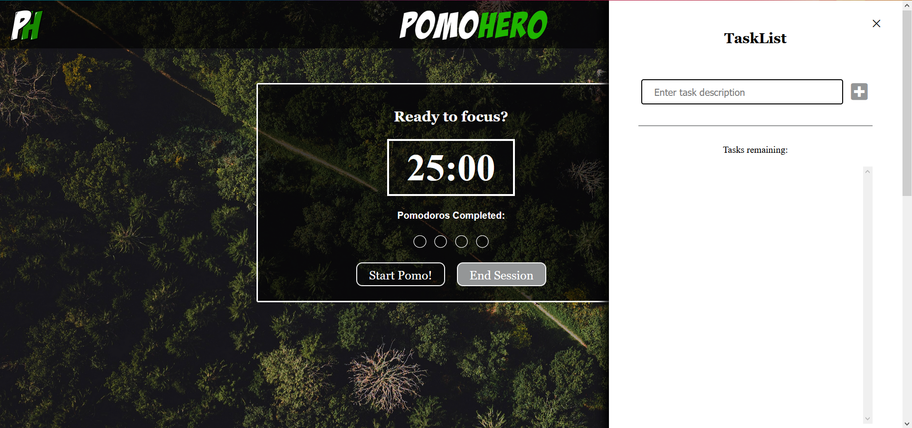
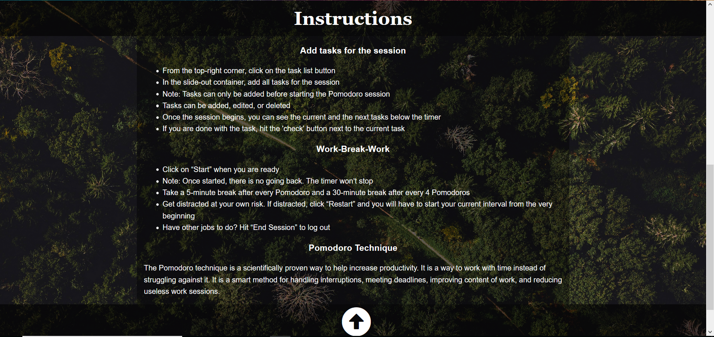

# Sprint 3 Review

## Teamato - Group 30

### Software Results
The end of sprint 3 has seen the completion of a majority of the sprint backlog that had been planned to be completed at the start of the sprint. There are a few very small issues that still need to be dealt with but hopefully, we will be able to take care of them in Sprint 4 i.e. The Last Sprint.

Our goal for this Sprint was to add more features to the MVP that we developed in Sprint 2. Some of these features that added were: 
* A TaskList: we provide users with a tasklist where they can add / check-off the tasks they need to get done. 
* Letting users switch color themes: in case the user dislikes our default theme for some reason, we added an alternative theme which the user can toggle to.
* Making our app mobile-responsive: in case the user tries to access our app through his mobile phone, we made sure it doesn’t act weird and is responsive.
* Adding hotkeys for added accessibility: in case the user doesn't want to or can’t use a mouse, we made our app to be completely navigable by just using keyboard strokes. 
We were also considering adding an analytics feature in our app if we are able to successfully deploy the other features quickly. But that wasn’t the case so we chose to drop that feature.

Apart from that, we also revamped our design to be more minimal and cool to the users’ eyes.

Apart from the added features, in this sprint, our team utilized a trunk-based development approach for our Git flow. Apart from the main branch, we had another central dev branch which was much more loose with its linting and testing protocols to allow easier merges. Developers will create small short-lived branches for whatever issue they are working on. These branches will branch off from the dev branch. Once a developer has finished their work on that branch, they will push those commits into the dev branch. Typically was done at least once a day. After certain issues and features have been implemented in dev, a new PR will be made that pushes all the dev branch code into a release branch i.e. the main branch.

In this sprint, we have developed about 90% of our product-to-be-released. We took care that our code is adequately tried and tested, both through unit and E2E tests, as well as manual PR reviews. This last week’s sprint i.e. The Last Sprint will be utilized to get done with the remaining 10% of the remaining development which is definitely a feasible goal.

### Software demonstration

### Team Accomplishments
As a team, we are satisfied with how the sprint has gone by. Everything went well, and we were able to do almost all that we had planned. The design group really stepped up in this sprint and gave us a drastically improved design; the development group also continued the great job of implementing the backend of the new features in an effective way, while following good coding practices.

### Team Member Efforts

**Muhammad Z Khan:** Oversaw the whole team while focusing more on the development part. I worked on some functionalities of our TaskList web component along with James and Xavier. Partnered with the dev team and took part in mob coding the whole architecture of our code to make it more centralized. Also wrote the tests for our Custom Web Components i.e. the taskList and taskDisplay. Created and updated our team's ADRs.

**Xavier:** Worked with Ivan and Yash in creating the HTML and CSS files. As a team, the 3 of us further developed upon the finalized component layout for the product (in a way that helped us to keep the longterm design in mind). Helped to realize the designs in terms of CSS styling, and some javascript components. As a coordinator, I worked with my other coordinator, MZ, in delegating roles and helping in whichever "department" needed aid. Helped to facilitate Sunday standup meetings and Retros.

**James Zhao:** I performed mob programming with MZ, Xavier, and Haaris to layout the foundations of the new Event Bus architecture. Then, I worked on refactoring the old code to work with the new architecture, and re-designed the TaskDisplay to server as a purely visual component by simplifying the logic and moving most of it into tasklist. I also added additional logic to disable buttons in various edge-case application states as well. Lastly, I also implemented all of the key binds to easily navigate the website and quickly implemented a feature that hides the taskbar when the pomodoros are in session. I also took notes during meetings.

**Ivan Robles:** Worked with Yash and Xavier on the design for the MVP - including layout of the entire page, button placements, and timer display. Designed several different high fidelity designs, did research on how colors impacted focus and concentration, created graphic designs for the logo and the banner for the web page and chose color palettes for the background. Also implemented CSS styling by working on the entire CSS file, adjusting text and background colors, positions and sizes of containers and texts, etc.

**Yash Shah:** I worked primarily on CSS, HTML, and on adding popup error messages and animations inside the JavaScript Web Components. Inside CSS, I split all of the layout and color attributes into separate files. I changed all of the hex color values to CSS variables, handled some negative paddings and margins from the previous sprint, styled all of the error messages, and added CSS transitions and animations. I worked with Ivan to solidify our existing theme and come up with a second theme. Inside HTML, I created a noscript section and styled it. I also changed some of the divs into main, header, and footer. I also changed icons into buttons to leverage inherent functionality.

**Haaris Waleh:** Did mob programming along with the other developers - MZ and James. Helped lay down the rules for style guidelines and enforcement. Primary implementor of using the Notification API which involved calling it using a new Notification object, adding audio sounds to be played after breaks and work sessions, as well as testing whether Notifications worked properly.

**Luke:** Was the primary builder for the pipeline. Handled the entire setup and maintenance of the pipeline, including a linting procedure using the GitHub Super Linter, a testing framework (Jest), and document generation with JSDoc. Also worked on handling merge conflicts for the Pull Requests from the dev and the design branches, as well as hosting of the app on Firebase. Planned on how the Git Flow will change for the next sprint after talking with team mentor and the Professor.

#### Current backlog 

- “alt” attributes need to be included in images 

  - Currently Lighthouse-dev outputs show that all categories are healthy (Performance, Best Practices, SEO  >= 90) Only “Accessibility” seems to be at a lower 61/100 score due primarily to the duration it takes for certain image files to download and appear on the user’s browser. 

  - Reasons: This is narrowed down mainly to our background image file, which has an extremely large resolution ( greater than 4k res ~ 8.6MB). 
  - Additionally, larger than required files are the images used in the completed Pomos icons, which are also large (~1MB) This is causing the overall average time for the page load-up to be disproportionately high. 

  - Solution: We may standardize the background image to be of one standard lower resolution. 2nd solution is to have one specific background resolution for each viewport size, however, it doesn’t eradicate the problem of long page load-up times for users with large viewports, so we might stick to the 1st one. 
  - Down-res of pomos completed image files as well

- Tooltips repositioning:
  - Reasons: Current tooltip positionings are out of place, we are looking for non-obstructive placements. The main task display’s tooltips are a little off-center as well. 

  - Placement of tooltips for the task-list page are currently covering the <input> values when a ‘wrong’ input is detected, displaying for a long duration of 5 seconds. 

  - Solution:
    We will reposition the tooltip so it doesn’t obstruct input value, and reduce duration.
    
- standardize the format of all written code (eg. abiding by our agreed upon notations, white-spacing rules, and variable naming conventions -- hungarian)

 
### Next Steps: 

- Turn instructions into modal display + Test modal display

- Hotkey features for easier access of buttons (Almost done / completed) + Test hotkey feature

- Adding Hotkey instructions into modal instruction display 

- Banner Image change possibly to one that is more of a minimalist style resembling Airbnb’s logo font

- Explain problems with attempting to fix safari bug?

