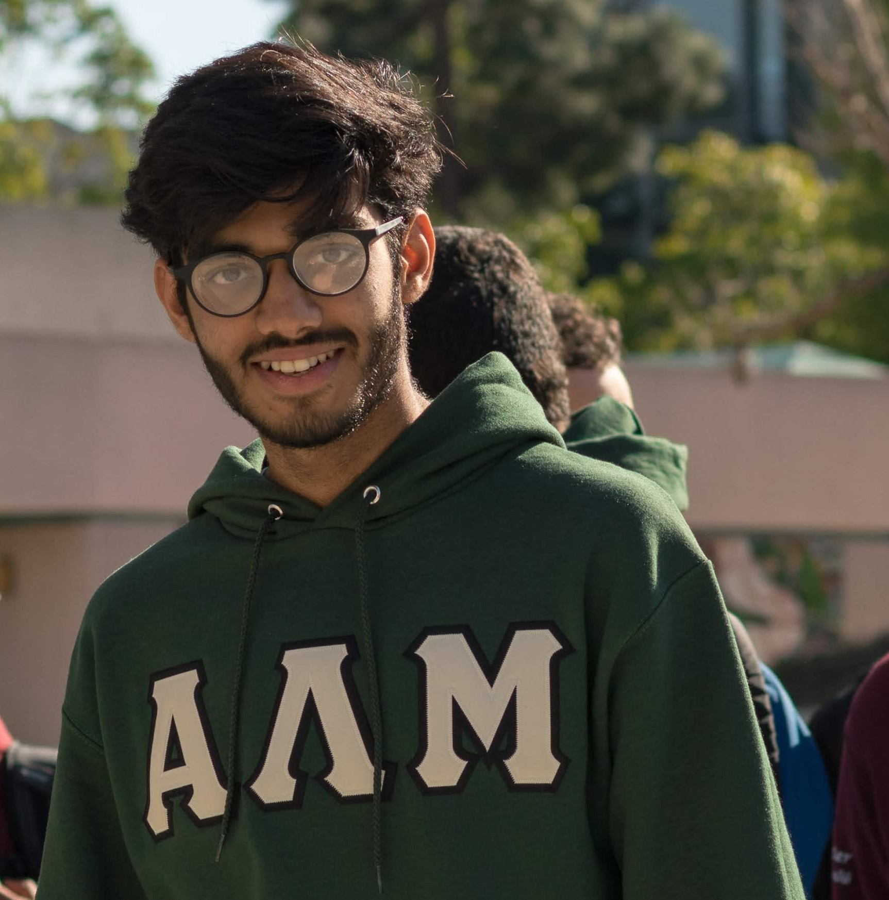
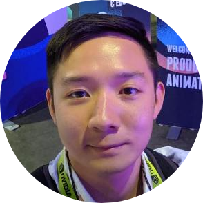
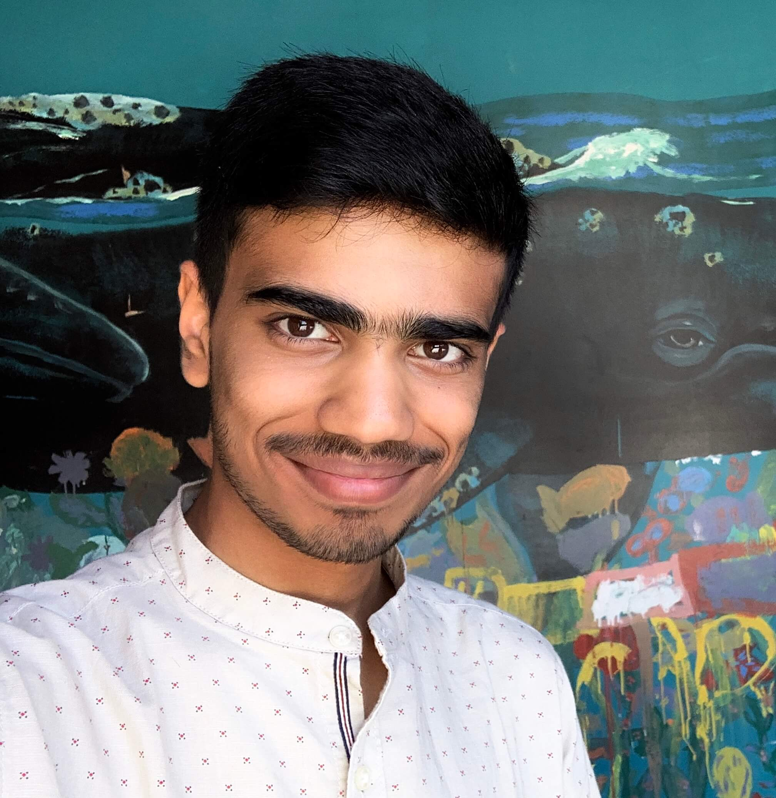
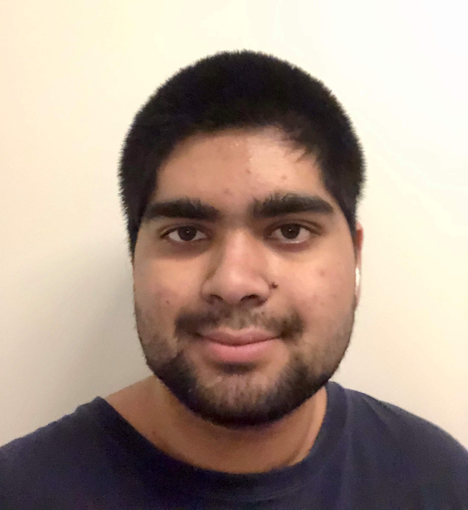

# Team-ato

**Theme:** Tomato Timers

**Mantra:** :tomato:Tackling one “Tomato” at a time! :tomato:

**Values:** Helping sleep deprived students organize

## Meet The Team:
<table>
<tr>
</tr>
<tr>
<td>

<h3>Muhammad Z Khan</h3>
 
 
2nd Year, Computer Science Major 
Role: Coordinator / Developer 
<a href="https://mz-k.github.io/">Personal Website</a>

</td>
<td>

<h3>Xavier Tan</h3>
 
 
4th Year Computer Engineering Major 
Role: Coordinator - Dev / Plan / Design 
<a href="https://xavierkst.github.io/CSE_110_Lab_2/">Personal Website</a> 

</td>
</tr>
<tr>
<td>

<h3>James Zhao</h3> 
 
2nd Year, Computer Science Major 
Role: Dev / Documentation 
<a href="https://jameszhao01.github.io/CSE110_Lab2/">Personal Website</a> 

</td>
<td>

<h3>Ivan Robles</h3> 
 
4th Year Computer Engineering Major 
Role: Planning / Designing / Testing 
<a href="https://i1robles.github.io/index.html/">Personal Website</a> 

</td>
<td>

<h3>Yash Shah</h3> 
 
2nd year Computer Science Major 
Role: Designing / Building 
<a href="https://ynshah3.github.io">Personal Website</a> 

</td>
</tr>
<tr>
<td>

<h3>Haaris Waleh</h3> 
 
3rd year  Computer Science Major 
Role: Designing / Dev 
<a href="https://hwaleh.github.io">Personal Website</a> 

</td>
<td>

<h3>Mrinmoy Dutta (Luke)</h3> 
 
2nd year Computer Science Major 
Role: Building / Testing 
<a href="https://lukedutta9.github.io/">Personal Website</a> 

</td>
</tr>
</table>
