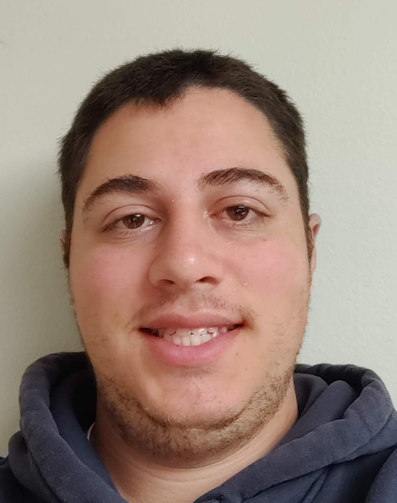
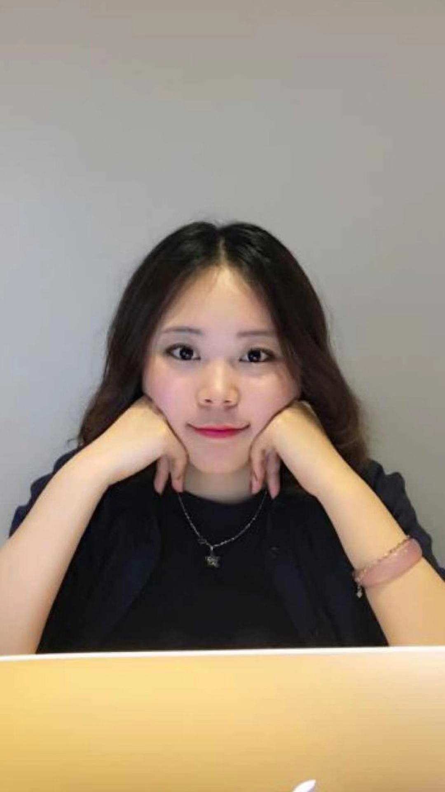
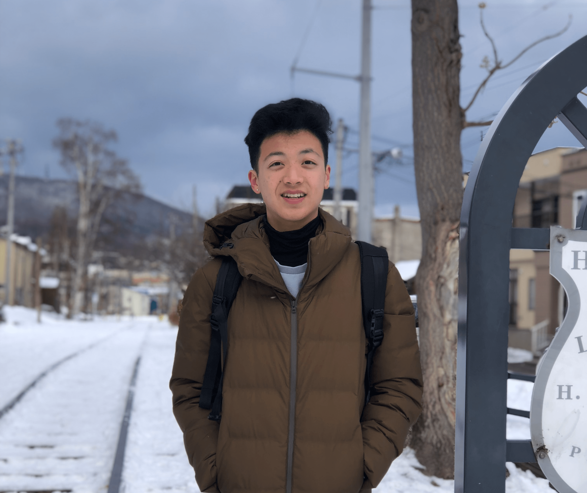
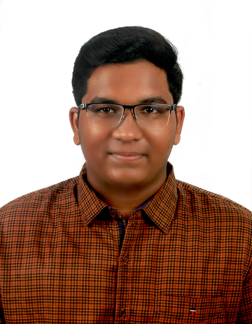
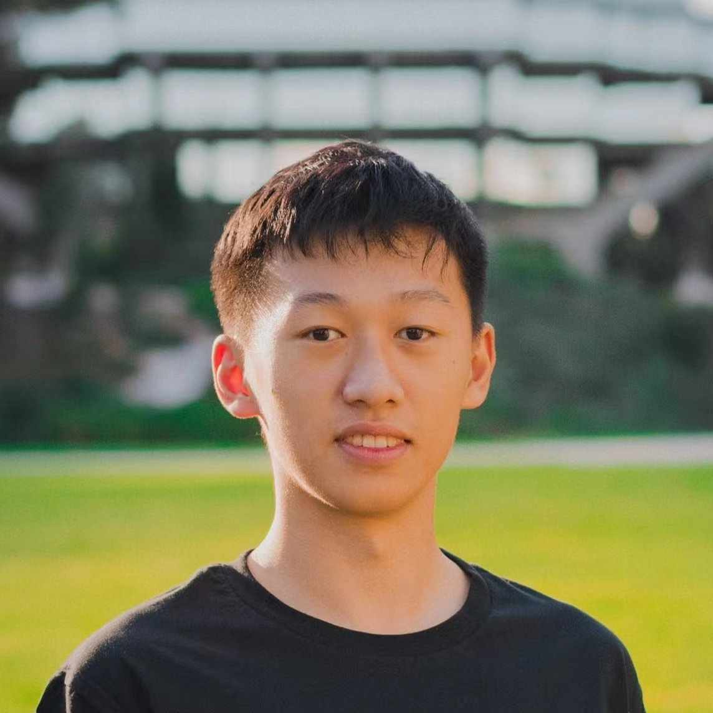

# Meet the Redeem Team

## Introduction

The Redeem Team was formed to complete our CSE 112 project at UCSD, which was to take a project a team member had previously worked on in CSE 110 and improve it to make it a 1.0, deployment-ready product that was up to industry standards. Each of us felt that there were many improvements we could make following our experience working on our CSE 110 project, and we were ready to redeem ourselves. We set our goal to be to work efficiently and effectively as a team to create a user-focused, well-tested, and polished 1.0 application.

## Team Members

### Evan Chen
(Image)
- Position: Developer
- (Bio)

### Matthew Cohen
 
- Position: Developer
- My name is Matthew and am from Los Angeles. I am a Computer Science major at UCSD in Warren college, graduating in June 2022. My interests include sports like basketball, soccer, and baseball. It was great to learn more about software engineering practices and to be part of this team. I look forward to using these skills in my career as a Software Engineer.

### Jenny Ding
 
- Position: Developer
- Hi, I'm Jenny(Juan) Ding and I am a fourth-year Computer Science major student at Warren. Before, I have also taken Pro. Powell's CSE 110, with both classes, I now have a better knowledge of how the software engineering should be like, and how we should handle the real feature in the company by following certain guildlines.

### Justin Huang
 
- Position: Developer
- Hi, my name is Justin, and I am a Computer Science major at UCSD in Warren College, graduating in Spring 2023. After just taking CSE 110 the quarter before, this was a breath of fresh air, as I found more freedom to create features, and felt more realistic to how software engineering jobs should be like. Through the lectures and my time spent working on this project, I have learned a lot of good practices and cherished useful experiences that I can't wait to apply to the software engineering industry when my time comes. 

### Ivan Robles
 
- Position: UI/UX Designer
- Hi, my name is Ivan Alejandro Robles Alvarez. I am a computer engineering major graduating from UCSD in June 2022. I'm an artist at heart; I love drawing, designing, and creating works of art, which includes software. I'm also passionate about helping others, which includes making things that everyone can use and enjoy, no matter their background or accessibility issues. These two traits are what motivate me to become the best front-end software engineer possible, always taking into consideration the effects of my software and not just churn out code.

### Rishmal Rohin Kumar
 
- Position: Lead
- Hi, my name is Rishmal Rohin Kumar, and I am a Computer Science major at UCSD, who is graduating in Spring 2023. I have loved learning more about Software Engineering, especially regarding being a lead, while working on this project, and I hope to use this experience in the industry as a Software Engineer. If you want to get to know more about me, here are links to my [LinkedIn](https://www.linkedin.com/in/rishmal-rohin-kumar/) and [GitHub](https://github.com/RishmalRohinkumar).

### George Wang
(Image)
- Position: Developer
- (Bio)

### Tony Wang
 
- Position: Lead
- Hi, my name is Tony(Yitian) Wang. I am a Computer Engineer major at UCSD graduating in June 2022. My CSE 110 experience and this project has taught me so much about software engineering and how to become a leader, and most importantly, how to evaluation situations and make decisions based on values and constraints. I am eager to learn more about software engineering in the future, and I am aspired to become a software engineer that create products that truly help users around the globe. If you want to know me more, here are links to my [GitHub](https://github.com/yitianwang18) and my [LinkedIn](https://www.linkedin.com/in/yitian-wang-51973514b/).

### Bill Wu
(Image)
- Position: Developer
- (Bio)
