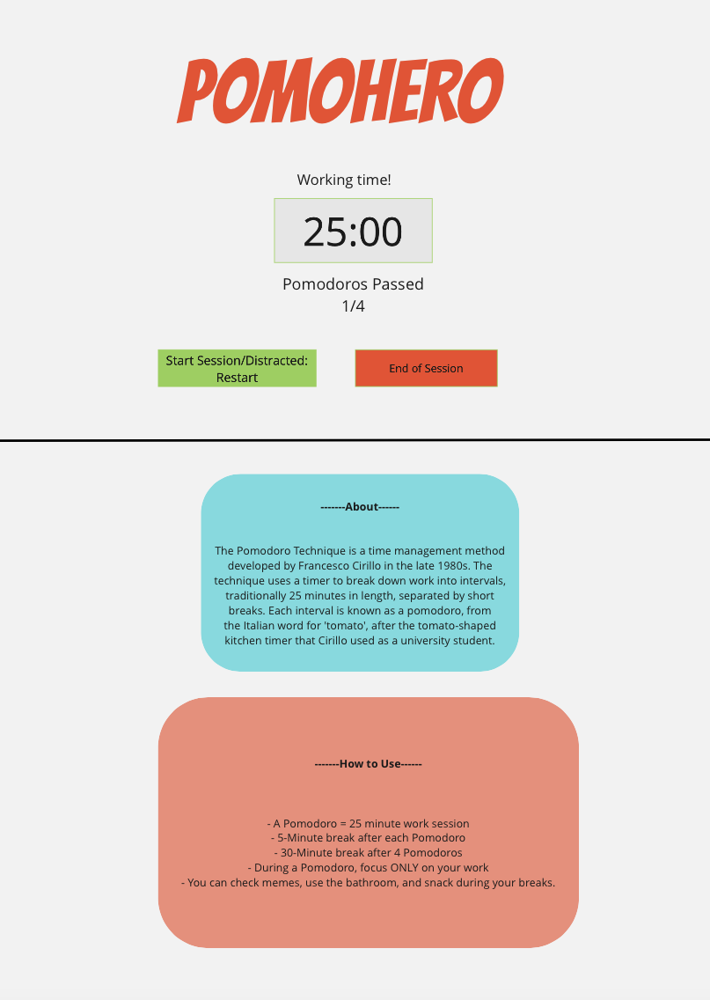
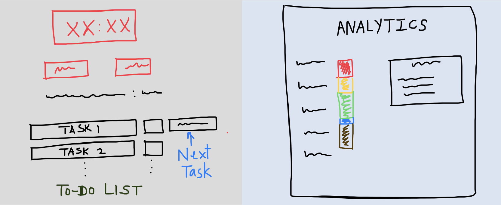

# PomoHero - A Pomodoro Timer App

In the world, many individuals and groups struggle with structured time management, keeping focus on important tasks, being held accountable for their mistakes, and learning from past experiences.

Many Pomodoro apps exist out there that tend to have too many overly-complicated features...

Or lack critical features that help analyze time management...

Or are inherently too distracting...

These apps are not allowing us to focus and concentrate effectively. Giving us the ability to pause the timer while working if we get distracted, or trying to visually satisfy us with unnecessary graphics achieves results contrary to what the Pomodoro Technique is meant to produce. If we can allow us to get distracted while working, we might as well not use the app at all! Also, giving us choices for customizability leads to unaccounted investments of time which we hadn't signed up for.

It is now time to right the wrongs.

## PomoHero

Our team came up with a solution idea that aims to incorporate the Pomodoro Technique to the fullest, automating as much as possible to make it easy for the user, keeping it simple to avoid distracting the user, and provifing clear analytics of both completions and mistakes to aid the user in learning better time management.

We have decided to go forward with the idea as a small-batch three-week project.

Here's how it works:

The app will have all of the basic functionality that the Pomodoro Technique lists. It will have a *Start* and a *Reset* button. Each individual Pomodoro session will be 25 minutes long, with a short break that is 5 minutes long after every Pomodoro session, and a long break that is 30 minutes long after 4 Pomodoro sessions have been completed...

In order to accomodate tight working schedules, the users will be provided an *End* button which will reset the count of the number of Pomodoro sessions, congratulate and reward the user on completing the number of Pomodoro sessions they did complete, and reset the timer. This will mark the end of the usage of the app currently as seen below...

A product is incomplete without a section that tells its users why they should use the app and the instructions that guide them through it. Many of our target users may not know about the Pomodoro Technique and it will be helpful to motivate them to reuse the product like so...

We will provide the instructions and the section on what the Pomodoro Technique is below the screen containing the timer and the buttons, such that the user will have to scroll down to have a look at them. We decided to do this so that the user is not distracted by all of the information and writings on the screen. This also incentivizes to focus on the task at hand during the working session and engage in side-activities during breaks or before starting the session.

We envision our product to look something like this after the first sprint...

The entire app will be automatic once the user clicks on the *Start* button. This will allow the user to focus on his work rather than on the app itself and to avoid increasing breaks and/or Pomodoro sessions if the user doesn’t choose to click the button immediately. The page will keep transitioning between showing working Pomodoro, short breaks, and long breaks. Hitting the reset button will restart the current Pomodoro instantly. The only way to stop the cycle/session of work is by clicking on the *End* button. This feature will help prevent unnecessary user interactions with the app and breaking of the Pomodoro Technique. A prototype of how this will work is linked here: [Automation](https://jameszhao01.github.io/pomodoro-prototype/index)

With the automating of the app, we needed to think of a way to notify the user when a Pomodoro gets completed, or when a break starts. These notifications could be either a web-notification or a simple audio alarm. We came to the decision that we would send the user browser notifications when the state of the app/timer changes. A prototype of how we will do this is linked here: [Notification](https://jameszhao01.github.io/pomodoro-prototype/notify)

We also thought of creating tasks, storing data, and reporting analytics to the user during and after the completion of the session. While these ideas can significantly improve the app, they are rabbit holes which can stretch the completion of the sprint beyond the proposed deadline and we will likely keep them for our future plans.

What we like about this product idea overall is that it is very straightforward to use. It stays true to the Pomodoro Technique. There is no over the top UI and no features that go anti-Pomodoro. 

## What we're not doing

No pause buttons. No extraordinary UIs. Minimal (or No) customizability choices for the user.

> Simplicity is the ultimate sophistication

for our product as well as for the user to focus. If users have come to use the app in order to focus, the app better allow them to focus and we will make sure this happens.

## Future Plans

Down the road we'd like to incorporate a To-Do List in order to allow the user to add tasks and track their completion. We may end up making our own To-Do List or fork the code for an existing To-Do List over using a To-Do API because we do not want our users to have to spend their time behind creating accounts and worrying about what their username or password was. Here is a prototype for how this will work: [Tasks](https://jameszhao01.github.io/pomodoro-prototype/task)

We would store the information - which and how many tasks were completed, how many Pomodoros did it take to complete each task, how many sessions did the user work for - in the Local Storage Database. We would like to store all of these information in a form that is easily accessible for generating reports. It would work like this: [Local Storage](https://jameszhao01.github.io/pomodoro-prototype/local)

The app will then be able to provide analytics/reports on how the user performed during the day. It will be a chart of how many pomodoros each task took enabling the user to see which tasks were the most time consuming, or which tasks were the least time consuming. We are thinking of this feature looking like so...

The idea behind incorporating the features of To-Do List, Analytics, and Local storage is that we do not want our users to waste their time looking for other external tools, where they would have to manually enter all of the data and wait for the results to be generated. We want to give our users a one-stop to provide a list of tasks that they want to get done with and automatically track how they are doing and presenting the results in a form that is easy to retrospect on. 

This may increase the complexity of our product by a notch, but providing the user with a one-for-all platform will make things simpler from the user's perspective as he/she doesn't have to deal with issues such of simultaneously working with two products, which in the end is our ultimate goal. If implemented carefully, a little bit more complicated Pomodoro timer with an integrated task-list is better than a simple Pomodoro timer coupled with an extenal, disconnected, and possibly complex, tasking tool. 

Also, the practice of retrospectively analyzing your work patterns is a noticeable part of the Pomodoro philosophy. Thus integrating task-lists to better user analytics will only increase the "Pomodoriness" of our web app.

The final product may end up looking like this...

